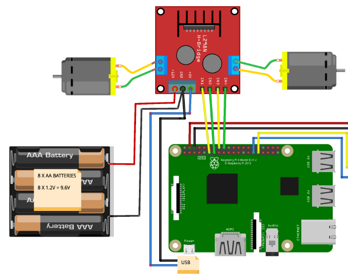
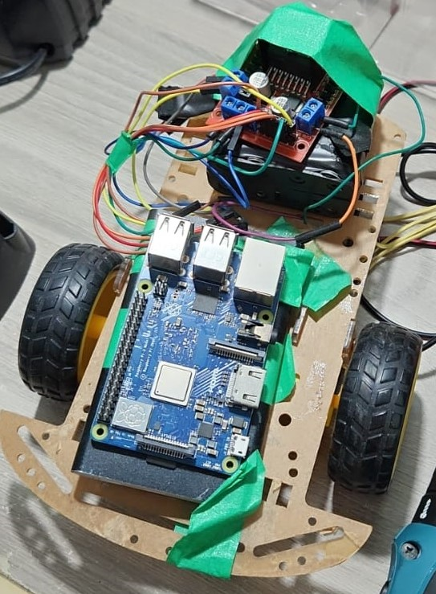

# Bixby-Car
Prototype of a mobile robot controlled by Samsung's virtual assistant, Bixby. 

Material used:
- 2WD chassis kit;
- 2 DC motors;
- Raspberry Pi 3;
- Driver L298N;
- Power bank.

Programming languages: Python and Bixby language

## Goal
Use the Raspberry Pi as a web server to receive commands from Bixby. Furthermore, use the raspberry as a controller for the motors and carry out locomotion according to the commands received from the virtual assistant.

The server code raises a local web server, so to create a tunnel and expose the server port for external communications, [ngrok](https://ngrok.com/) was used.

## Hardware
The hardware structure:

The assembled mobile robot structure:

## Project structure
- carbixby.capsule: Bixby Capsule Folder. A capsule is a set of models, views, events, actions, and other structures that allow Bixby to understand and respond to user requests.
- RobotCode: codes run on the raspberry pi. Local web server and control of the robot's DC motors.

## Extra information
This project was developed through my activities at Samsung Ocean Brasil.

This project was presented at the events:
- [Arduino Day Manaus 2021](https://www.google.com/url?sa=i&url=https%3A%2F%2Fwww.sympla.com.br%2Farduino-day-manaus-21__1164006&psig=AOvVaw2rE1bwGn6smxoTRaQ7BW0G&ust=1698100969070000&source=images&cd=vfe&ved=0CBIQjhxqFwoTCNjx0JfdioIDFQAAAAAdAAAAABAE)
- [IOT Week 2020](https://www.instagram.com/p/CH7_SXjjYyl/?igshid=MmU2YjMzNjRlOQ==)
- [TDC 2019 - Recife](https://thedevconf.com/tdc/2019/recife/trilha-internet-das-coisas#descricao-132)